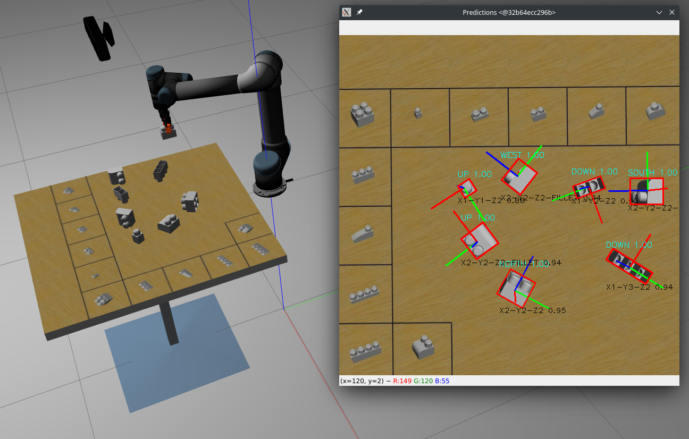
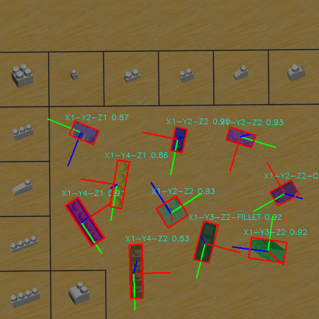

# Lego Builder
Lego builder is an experimental playground for manipulating Lego blocks.
The goal is to be able to create a structured assembly starting from a
sparse and randomly oriented set of blocks.\
\
To reach our goal we had to implement a few features:
+ A manipulation system with great dexterity and precision
+ A computer vision system to infer exact models position and orientation



## How to run
The project can be launched from the `./run.sh` script which will create a neat docker image containing all the necessary dependencies.
```
$ ./run.sh docker_bash
```
After running the above command you will find yourself in a shell instance inside the docker container. From there you can run one of the following commands:
```
$ ./run.sh launch_ass2
$ ./run.sh launch_ass3
$ ./run.sh launch_ass4
```


## Kinematics
The kinamatics system is able to manipulate lego models in a very dexterous way, straightening them in one move and
bringing them to the selected position.

Lego straightening and stacking can be found [`here`](./src/lego_builder/lego_builder_kinematics/main.ass3.py)\
Construction of an arbitrary assembly can be found [`here`](./src/lego_builder/lego_builder_kinematics/main.ass4.py)

## Vision
The custom real-time vision pipeline can be found [`here`](./src/lego_builder/lego_builder_vision/main.py)\
The custom dataset farming toolset can be found [`here`](./src/lego_builder/lego_builder_dataset_farmer)

The following image visualizes the 6DoF pose estimation for each model represented by RGB axes projected onto the camera plane.

